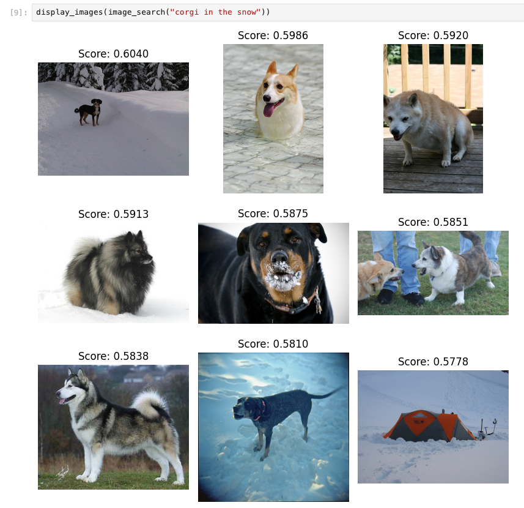

# Image Search with MongoDB Atlas Vector Search

This repository contains a Jupyter Notebook demonstrating how to generate
vector embeddings for both text and images using a multi-modal embedding model.

## Getting Ready To Run The Notebook

The first thing you'll want to do is create a virtual environment using your favorite technique. I tend to use [venv](https://docs.python.org/3/library/venv.html), which comes with Python.

Once you've done that, install dependencies with:

```
pip install -r requirements.txt
```

You'll need to set an environment variable, `MONGODB_URI`, containing the connection string for your MongoDB cluster.

One more thing you'll need is an "images" directory, containing some images to index! I downloaded  [Kaggle's ImageNet 1000 (mini) dataset](https://www.kaggle.com/datasets/ifigotin/imagenetmini-1000), which contains lots of images at around 4GB, but you can use a different dataset if you prefer. The notebook searches the "images" directory recursively, so you don't need to have everything at the top-level.

Then you can fire up the notebook with:

```
jupyter notebook "Image Search.ipynb"
```

At the end of the tutorial, you'll be able to search for images with snippets
of text, like this:

